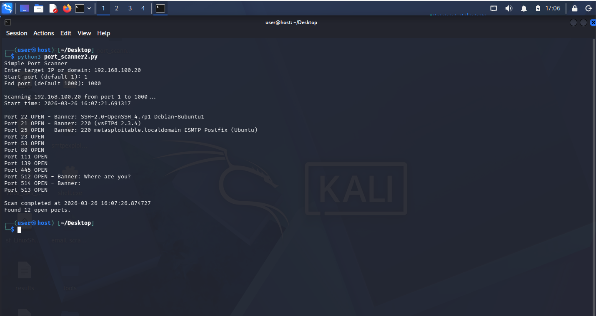

# Port Scanner - Python

Multi-threaded TCP port scanner with banner grabbing.

## How to Run
```bash
python port_scanner.py
```

Technologies - Python (socket, threading)

Concepts used:
Network reconnaissance, ethical scanning, multi-threading.




Built by Avik Choudhary
